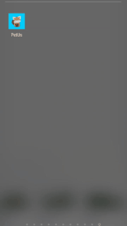
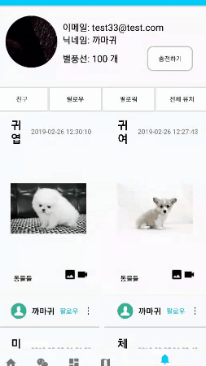

# PetUs
   

## 소개

PetUs는 반려동물 컨텐츠 공유를 위한 SNS 어플리케이션입니다. 
동영상 링크: https://youtu.be/XCeTM8Ssy3A

## 주요 기능
- 회원가입, 로그인, google 로그인
- 이미지 크롭, 필터
- 주변 동물 카페 찾기
- 카페 소셜 리뷰 가져오기
- 포스트 업로드
- 유저 팔로우, 친구 맺기 기능
- 1:1 채팅, 그룹 채팅
- 영상통화
- 라이브 스트리밍
- 카카오페이를 이용한 별풍선 구매, 별풍선 선물하기

## 사용 기술
- 언어: Java, php
- 운영체제: Ubuntu
- 웹 서버: Apache
- 데이터베이스: MySQL
- 사용 라이브러리: Glide, google API, multiple media picker, Vidyo.io, Android image filter, Android Image Cropper, FCM 등

## 기능 설명
### 1. 회원가입, 로그인, google 로그인
  
사용자는 직접 회원가입을 하거나 구글 계정을 이용해 로그인할 수 있습니다. 
이메일과 닉네임 중복 검사를 하면 더 이상 값을 바꿀 수 없습니다. 
프로필 사진을 촬영하거나 앨범에서 가져올 수 있습니다. 

#### 이미지 크롭, 필터
 
이미지 크롭 기능과 필터 기능을 이용하여 사진을 편집할 수 있습니다. 

### 2. 주변 동물 카페 찾기
 
내 위치 주변 2km 내에 있는 동물 카페 리스트를 가져옵니다. 
카페를 누르면 해당 카페에 대한 소개, 이미지, 소셜 리뷰, 위치 정보 등을 볼 수 있습니다. 

#### 지도에서 보기, 클러스터링
 
오른쪽 위의 지도 아이콘을 누르면 지도 위에 내 위치와 주변 동물 카페 위치가 표시됩니다. 
지도 위의 점을 누르면 카페 이름과 주소가 표시됩니다. 
지도를 축소하면 마커들이 뭉치며 마커들의 개수가 표시됩니다. 

#### 카페 소셜 리뷰 가져오기
 
선택한 카페와 관련된 소셜 리뷰를 가져옵니다. 
naver blog API를 이용하였습니다. 

### 3. 포스트 업로드
  
사용자는 업로드 기능을 이용하여 사진과 동영상을 게시할 수 있습니다. 
처음 게시물은 2개씩 로드되며 밑으로 스크롤을 내리면 이전 게시물이 2개씩 더 나타납니다. 
스크롤을 당기면 새로고침을 할 수 있습니다. 

### 4. 유저 팔로우, 친구 맺기
 
마이 페이지에서 유저 목록을 볼 수 있고 원하는 유저를 팔로우할 수 있습니다. 
서로를 팔로우하면 친구관계가 성립됩니다. 
친구에게 1:1 채팅과 영상통화를 할 수 있고, 단체 채팅방을 만들 때 초대할 수 있습니다. 

### 5. 1:1 채팅, 그룹 채팅
친구와 1:1 채팅, 그룹 채팅을 할 수 있습니다. 

#### 1:1 채팅
 
친구와 1:1 채팅을 할 수 있습니다. 
메세지를 보내면 자동으로 채팅방이 만들어집니다. 
상대방과 메세지와 사진을 주고받을 수 있습니다. 
상대방이 채팅방을 보고 있지 않을 때 메세지가 도착하면 알림이 뜹니다. 
알림을 누르면 해당 채팅방으로 이동합니다. 

#### 그룹 채팅
채팅방 목록에서 친구들과 그룹 채팅방을 만들 수 있습니다. 
채팅방 이름을 설정할 수 있습니다. 
채팅방 이름을 설정하지 않을 경우 방 이름이 자동으로 설정됩니다. 

### 6. 영상통화
 
친구의 프로필 화면에서 영상통화를 신청할 수 있습니다. 
영상통화를 받은 상대방은 통화 거절을 하거나 수락할 수 있습니다. 
40초 동안 응답이 없으면 영상통화가 자동으로 종료됩니다. 
카메라 전환, 카메라 오프, 마이크 끄기 기능이 있습니다. 

### 7. 라이브 스트리밍
 
라이브 스트리밍 기능을 통해 방송할 수 있습니다. 
시청자는 채팅 기능을 통해 스트리머와 소통할 수 있습니다. 

#### 별풍선 선물하기
 
시청자는 스트리머에게 별풍선을 후원할 수 있습니다. 
스트리머는 별풍선 응답 메세지를 설정할 수 있습니다. 
시청자가 별풍선을 후원할 때 원하는 메세지를 입력하면 TTS를 통해 메세지가 음성으로 재생됩니다. 

#### 카카오페이를 이용한 별풍선 구매
 
후원자는 카카오페이 결제를 통해 별풍선을 구매할 수 있습니다. 
